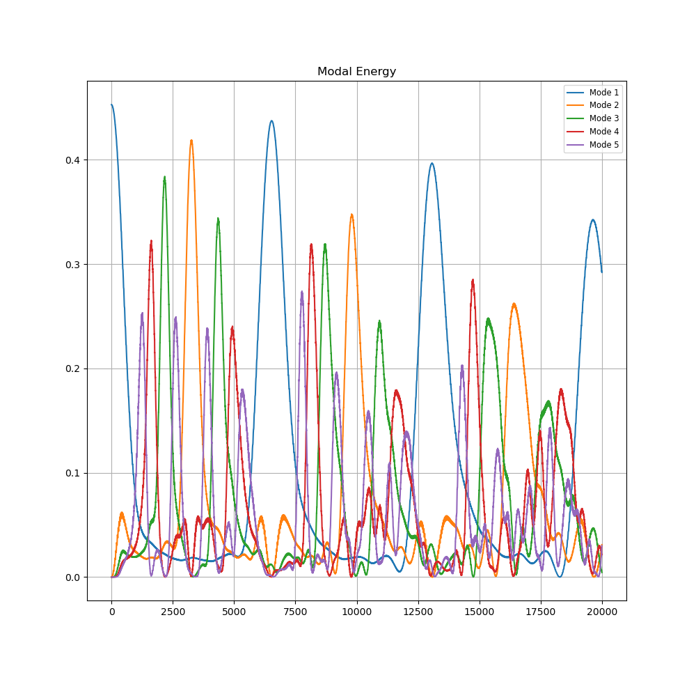
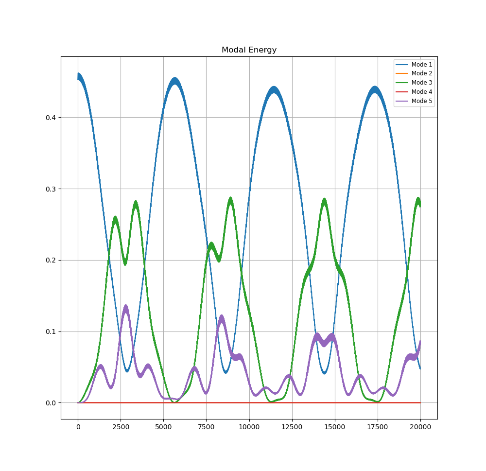

# Fermi Pasta Ulam Tsingou simulation

A recreation of the FPUT simulation written in python.
Contains both the $\alpha$-PUT and $\beta$-PUT variants.

## How to run the simulation
Choose initial conditions file in `config.py` and then run the `fput.py` script, this will open a matplotlib window with the real time plotting.

## Plotter.py
After the simulation is run, raw data is dumped into `simulation_dump.npz`, this can be furtherly analyzed using the `plotter.py` file, which can show hamiltonian plot and some statistics on its preservation or a complete modal energy plot.

An example of the modal energy plot of an $\alpha$-FPUT simulation (only showing the first 5 modes).

An example of the modal energy plot of an $\beta$-FPUT simulation (only showing the first 5 modes).

